# 🎨 Exploratory Data Analysis (EDA) - A Fun Guide for Everyone!

## 📚 What is EDA?

Imagine you just got a huge box of LEGO blocks! Before building anything cool, you'd want to:
- See what pieces you have
- Sort them by color and size
- Count how many of each type
- Think about what you can build

**That's exactly what EDA is!** But instead of LEGO blocks, we're exploring data (information/numbers).

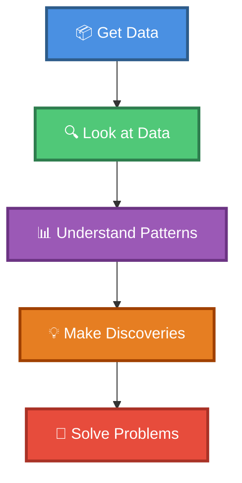

---

## 🎯 The EDA Journey

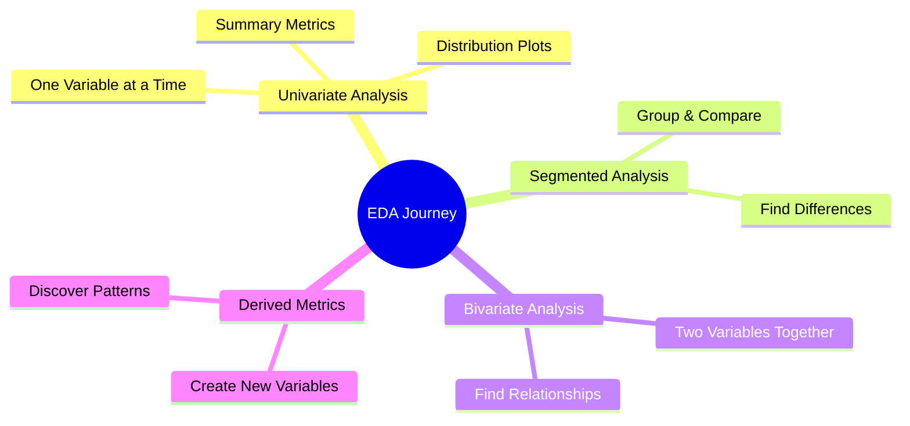

---

## � Python for EDA - Your Data Analysis Toolkit!

Throughout this guide, we'll use **Python** to analyze data! Python is like a super-powered calculator that can:
- 📊 Create beautiful charts and graphs
- 🧮 Calculate statistics automatically
- 📈 Find patterns in large datasets
- 💾 Work with thousands of data points easily

### 📦 Essential Python Libraries

```python
# Import the tools we need
import pandas as pd           # For working with data tables
import numpy as np            # For math and calculations
import matplotlib.pyplot as plt  # For creating charts
import seaborn as sns         # For beautiful visualizations

# Set up nice-looking plots
plt.style.use('seaborn-v0_8-darkgrid')
sns.set_palette("husl")
```

**What each library does:**
- **pandas** - Think of it as Excel for Python! Works with tables of data
- **numpy** - Does math really fast, handles numbers and calculations
- **matplotlib** - Creates all kinds of charts and graphs
- **seaborn** - Makes matplotlib charts look beautiful and professional

---

## � Chapter 1: Understanding Variables (Types of Information)

Think of variables like different types of toys in your toy box!

### 🏷️ Types of Variables

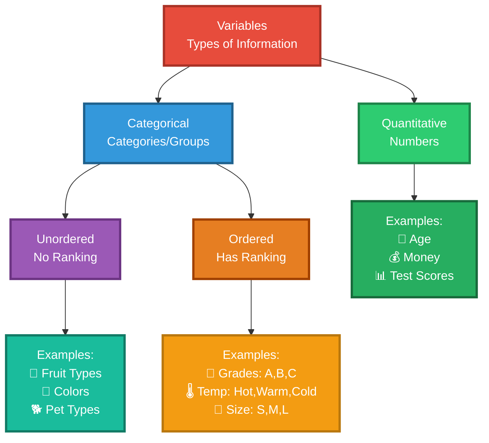

### 🎪 Real-Life Examples

**Unordered Categorical** (Like choosing ice cream flavors - no "best" order):
- 🍦 Ice cream flavors: Chocolate, Vanilla, Strawberry
- 🎨 Favorite colors: Red, Blue, Green
- 🐾 Types of pets: Dog, Cat, Fish

**Ordered Categorical** (Like video game levels - has order):
- 🎮 Game difficulty: Easy → Medium → Hard
- 📚 School grades: A → B → C → D
- 🌡️ Temperature feeling: Cold → Cool → Warm → Hot

**Quantitative** (Numbers you can count or measure):
- 🎂 Your age: 8, 9, 10 years
- 💰 Money in piggy bank: $5, $10, $20
- 📏 Height: 120 cm, 130 cm, 140 cm

---

## 📊 Chapter 2: Univariate Analysis (Looking at One Thing at a Time)

**Univariate** = "Uni" (one) + "variate" (variable) = Looking at ONE variable

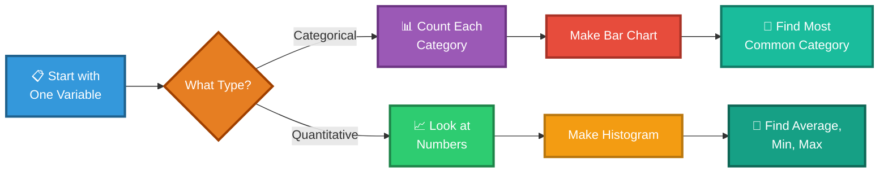

### 🎨 Example: Analyzing Favorite Fruits in Class

**Step 1: Collect Data**
- 🍎 Apple: 10 kids
- 🍌 Banana: 7 kids
- 🍊 Orange: 5 kids
- 🍇 Grapes: 8 kids

**Step 2: Summary Metrics** (Quick Facts)
- **Mode** (Most popular): Apple! 🍎
- **Total students**: 30 kids
- **Variety**: 4 different fruits

### 🐍 Python Example: Categorical Data Analysis

```python
import pandas as pd
import matplotlib.pyplot as plt

# Create data for favorite fruits
fruits_data = {
    'Fruit': ['Apple', 'Banana', 'Orange', 'Grapes'],
    'Count': [10, 7, 5, 8]
}
df_fruits = pd.DataFrame(fruits_data)

# Display the data
print(df_fruits)
print(f"\nMost popular fruit: {df_fruits.loc[df_fruits['Count'].idxmax(), 'Fruit']}")
print(f"Total students: {df_fruits['Count'].sum()}")

# Create a bar chart
plt.figure(figsize=(10, 6))
plt.bar(df_fruits['Fruit'], df_fruits['Count'], color=['red', 'yellow', 'orange', 'purple'])
plt.xlabel('Fruit Type', fontsize=12)
plt.ylabel('Number of Students', fontsize=12)
plt.title('Favorite Fruits in Class', fontsize=14, fontweight='bold')
plt.grid(axis='y', alpha=0.3)

# Add count labels on top of bars
for i, count in enumerate(df_fruits['Count']):
    plt.text(i, count + 0.2, str(count), ha='center', fontweight='bold')

plt.show()
```

**Output:**
```
     Fruit  Count
0    Apple     10
1   Banana      7
2   Orange      5
3   Grapes      8

Most popular fruit: Apple
Total students: 30
```

### 📏 Summary Metrics for Numbers

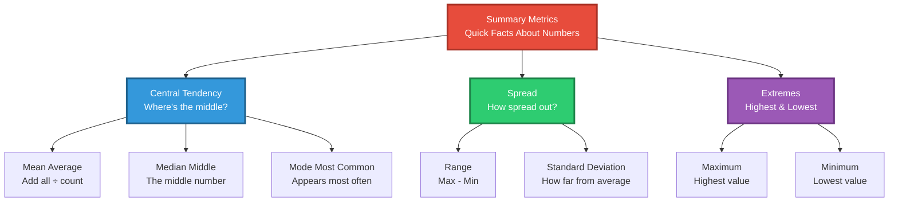

### 🎯 Easy Example: Test Scores

Scores: 70, 75, 80, 80, 85, 90, 95

- **Mean** (Average): (70+75+80+80+85+90+95) ÷ 7 = **82.1**
- **Median** (Middle): **80** (the middle number when sorted)
- **Mode** (Most common): **80** (appears twice)
- **Range**: 95 - 70 = **25**
- **Min**: **70**, **Max**: **95**

### 📐 Mathematical Formulas

**Mean (Average):**
```
Mean = (Sum of all values) / (Number of values)
μ = (x₁ + x₂ + x₃ + ... + xₙ) / n
```

**Median:**
- Sort the data
- If odd number of values: middle value
- If even number of values: average of two middle values

**Standard Deviation (How spread out the data is):**
```
σ = √[Σ(xᵢ - μ)² / n]
Where:
- σ = standard deviation
- xᵢ = each value
- μ = mean
- n = number of values
```

**Variance:**
```
Variance = σ²
```

### 🐍 Python Example: Analyzing Quantitative Data

```python
import pandas as pd
import numpy as np
import matplotlib.pyplot as plt

# Test scores data
scores = [70, 75, 80, 80, 85, 90, 95]

# Calculate summary statistics
mean_score = np.mean(scores)
median_score = np.median(scores)
std_dev = np.std(scores)
variance = np.var(scores)
min_score = np.min(scores)
max_score = np.max(scores)
range_score = max_score - min_score

print("📊 Summary Statistics:")
print(f"Mean (Average): {mean_score:.2f}")
print(f"Median (Middle): {median_score}")
print(f"Standard Deviation: {std_dev:.2f}")
print(f"Variance: {variance:.2f}")
print(f"Minimum: {min_score}")
print(f"Maximum: {max_score}")
print(f"Range: {range_score}")

# Create histogram
plt.figure(figsize=(10, 6))
plt.hist(scores, bins=5, color='skyblue', edgecolor='black', alpha=0.7)
plt.axvline(mean_score, color='red', linestyle='--', linewidth=2, label=f'Mean: {mean_score:.1f}')
plt.axvline(median_score, color='green', linestyle='--', linewidth=2, label=f'Median: {median_score}')
plt.xlabel('Test Scores', fontsize=12)
plt.ylabel('Frequency', fontsize=12)
plt.title('Distribution of Test Scores', fontsize=14, fontweight='bold')
plt.legend()
plt.grid(axis='y', alpha=0.3)
plt.show()
```

### 🏏 Real-World Example: Cricket Batsman Runs Analysis

**Question:** A batsman has scored the following runs in different matches. Plot a bar chart showing runs scored on the x-axis and frequency/count on the y-axis. In which bucket has he scored runs the most often?

```python
import pandas as pd
import matplotlib.pyplot as plt
import numpy as np

# Batsman's runs in different matches
runs = [23, 45, 67, 12, 89, 34, 56, 78, 45, 23, 67, 90, 12, 45, 56, 
        34, 78, 89, 23, 45, 67, 34, 56, 78, 45, 23, 12, 89, 67, 45]

# Create bins (buckets) for runs
bins = [0, 20, 40, 60, 80, 100]
labels = ['0-20', '21-40', '41-60', '61-80', '81-100']

# Categorize runs into bins
runs_binned = pd.cut(runs, bins=bins, labels=labels, include_lowest=True)

# Count frequency in each bin
frequency = runs_binned.value_counts().sort_index()

print("📊 Runs Distribution:")
print(frequency)
print(f"\n🎯 Most frequent bucket: {frequency.idxmax()} runs (appeared {frequency.max()} times)")

# Create bar chart
plt.figure(figsize=(12, 6))
bars = plt.bar(frequency.index, frequency.values, color='#2ECC71', edgecolor='black', linewidth=1.5)
plt.xlabel('Runs Scored (Buckets)', fontsize=13, fontweight='bold')
plt.ylabel('Frequency (Number of Times)', fontsize=13, fontweight='bold')
plt.title('Cricket Batsman: Runs Distribution Analysis', fontsize=15, fontweight='bold')
plt.grid(axis='y', alpha=0.3, linestyle='--')

# Add value labels on bars
for bar in bars:
    height = bar.get_height()
    plt.text(bar.get_x() + bar.get_width()/2., height,
             f'{int(height)}',
             ha='center', va='bottom', fontweight='bold', fontsize=11)

plt.tight_layout()
plt.show()

# Additional statistics
print(f"\n📈 Additional Statistics:")
print(f"Total matches: {len(runs)}")
print(f"Average runs: {np.mean(runs):.2f}")
print(f"Highest score: {np.max(runs)}")
print(f"Lowest score: {np.min(runs)}")
print(f"Median score: {np.median(runs):.2f}")
```

**Expected Output:**
```
📊 Runs Distribution:
0-20       3
21-40      8
41-60      9
61-80      7
81-100     3

🎯 Most frequent bucket: 41-60 runs (appeared 9 times)

📈 Additional Statistics:
Total matches: 30
Average runs: 50.27
Highest score: 90
Lowest score: 12
Median score: 50.50
```

**Answer:** The batsman scored runs in the **41-60 bucket most often** (9 times out of 30 matches)!

---

## 🔍 Chapter 3: Segmented Univariate Analysis (Comparing Groups)

Now we're comparing the same thing across different groups!

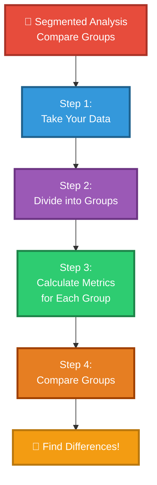

### 🎮 Example: Video Game Scores by Age Group

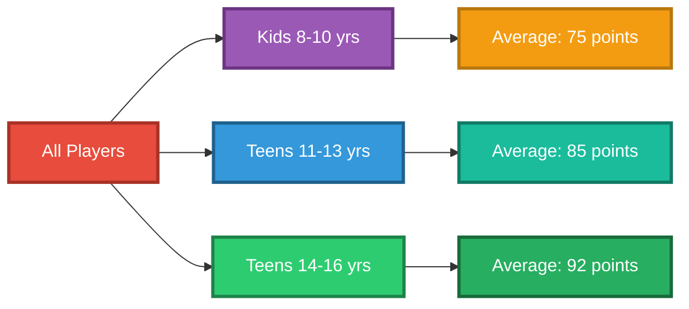

**Discovery**: Older kids score higher on average! 🎯

### 🐍 Python Example: Segmented Analysis

```python
import pandas as pd
import matplotlib.pyplot as plt
import seaborn as sns

# Create dataset for video game scores by age group
data = {
    'Age_Group': ['8-10']*10 + ['11-13']*10 + ['14-16']*10,
    'Score': [72, 78, 75, 70, 80, 73, 76, 74, 71, 81,  # 8-10 years
              88, 82, 87, 85, 90, 83, 86, 84, 81, 89,  # 11-13 years
              95, 90, 93, 92, 96, 91, 94, 89, 97, 88]  # 14-16 years
}
df_games = pd.DataFrame(data)

# Calculate statistics for each group
group_stats = df_games.groupby('Age_Group')['Score'].agg(['mean', 'median', 'min', 'max', 'std'])
print("📊 Statistics by Age Group:")
print(group_stats)

# Create grouped bar chart
plt.figure(figsize=(12, 6))
age_groups = df_games['Age_Group'].unique()
means = [df_games[df_games['Age_Group']==ag]['Score'].mean() for ag in age_groups]

bars = plt.bar(age_groups, means, color=['#9B59B6', '#3498DB', '#2ECC71'], 
               edgecolor='black', linewidth=2)
plt.xlabel('Age Group', fontsize=13, fontweight='bold')
plt.ylabel('Average Score', fontsize=13, fontweight='bold')
plt.title('Video Game Scores by Age Group', fontsize=15, fontweight='bold')
plt.ylim(0, 100)
plt.grid(axis='y', alpha=0.3)

# Add value labels
for bar, mean in zip(bars, means):
    plt.text(bar.get_x() + bar.get_width()/2., bar.get_height() + 1,
             f'{mean:.1f}', ha='center', fontweight='bold', fontsize=12)

plt.tight_layout()
plt.show()

# Create box plot for detailed comparison
plt.figure(figsize=(12, 6))
sns.boxplot(data=df_games, x='Age_Group', y='Score', palette='Set2')
plt.xlabel('Age Group', fontsize=13, fontweight='bold')
plt.ylabel('Score', fontsize=13, fontweight='bold')
plt.title('Score Distribution by Age Group (Box Plot)', fontsize=15, fontweight='bold')
plt.grid(axis='y', alpha=0.3)
plt.tight_layout()
plt.show()
```

**Output:**
```
📊 Statistics by Age Group:
           mean  median  min  max       std
Age_Group                                  
8-10       75.0    74.5   70   81  3.771236
11-13      85.5    85.5   81   90  3.027650
14-16      92.5    92.5   88   97  3.027650
```

---

## 🤝 Chapter 4: Bivariate Analysis (Looking at Two Things Together)

**Bivariate** = "Bi" (two) + "variate" (variable) = Looking at TWO variables together

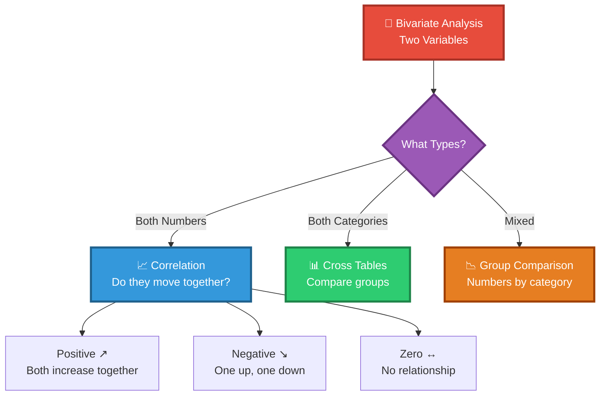

### 🌡️ Understanding Correlation (Relationship Between Numbers)

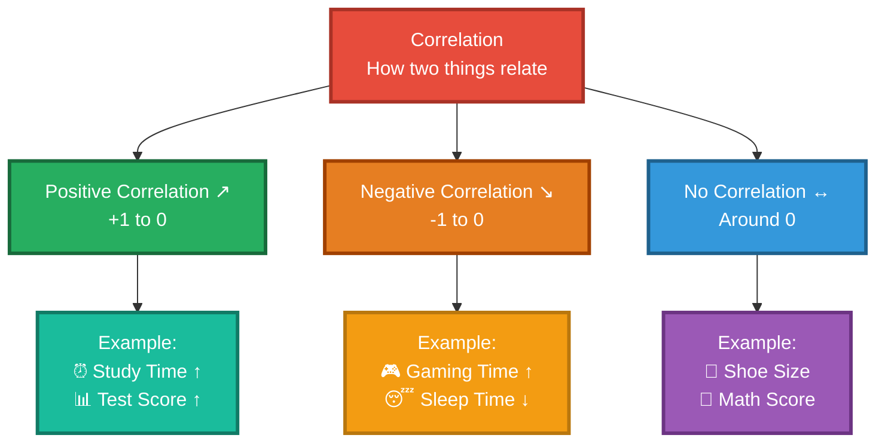

### 🎯 Real Examples Kids Can Understand

**Positive Correlation** (Both go up together):
- 📚 More study hours → 📈 Better grades
- 🏃 More practice → ⚽ Better at sports
- 🌧️ More rain → ☔ More umbrellas sold

**Negative Correlation** (One up, one down):
- 🎮 More video games → 📉 Less homework time
- 🍭 More candy → 🦷 More cavities
- 🏃 More exercise → ⚖️ Less weight

**No Correlation** (Not related):
- 👟 Shoe size → 🧮 Math test score
- 🎨 Favorite color → 📏 Height
- 🐕 Number of pets → 🎂 Birthday month

### 📐 Correlation Formula

**Pearson Correlation Coefficient (r):**
```
r = Σ[(xᵢ - x̄)(yᵢ - ȳ)] / √[Σ(xᵢ - x̄)² × Σ(yᵢ - ȳ)²]

Where:
- r = correlation coefficient (-1 to +1)
- xᵢ, yᵢ = individual data points
- x̄, ȳ = means of x and y
- Σ = sum of all values
```

**Interpretation:**
- **r = +1**: Perfect positive correlation
- **r = +0.7 to +1**: Strong positive correlation
- **r = +0.3 to +0.7**: Moderate positive correlation
- **r = 0**: No correlation
- **r = -0.3 to -0.7**: Moderate negative correlation
- **r = -0.7 to -1**: Strong negative correlation
- **r = -1**: Perfect negative correlation

### 🐍 Python Example: Correlation Analysis

```python
import pandas as pd
import numpy as np
import matplotlib.pyplot as plt
import seaborn as sns

# Example 1: Positive Correlation - Study Hours vs Test Scores
study_hours = [1, 2, 3, 4, 5, 6, 7, 8, 9, 10]
test_scores = [45, 52, 58, 65, 70, 75, 82, 88, 92, 95]

# Calculate correlation
correlation = np.corrcoef(study_hours, test_scores)[0, 1]
print(f"📊 Correlation between Study Hours and Test Scores: {correlation:.3f}")

# Create scatter plot
fig, axes = plt.subplots(1, 3, figsize=(18, 5))

# Plot 1: Positive Correlation
axes[0].scatter(study_hours, test_scores, color='#2ECC71', s=100, edgecolor='black', linewidth=1.5)
axes[0].plot(np.unique(study_hours), 
             np.poly1d(np.polyfit(study_hours, test_scores, 1))(np.unique(study_hours)),
             color='red', linewidth=2, linestyle='--', label='Trend Line')
axes[0].set_xlabel('Study Hours', fontsize=12, fontweight='bold')
axes[0].set_ylabel('Test Scores', fontsize=12, fontweight='bold')
axes[0].set_title(f'Positive Correlation\nr = {correlation:.3f}', fontsize=13, fontweight='bold')
axes[0].grid(alpha=0.3)
axes[0].legend()

# Example 2: Negative Correlation - Gaming Hours vs Sleep Hours
gaming_hours = [1, 2, 3, 4, 5, 6, 7, 8, 9, 10]
sleep_hours = [9, 8.5, 8, 7.5, 7, 6.5, 6, 5.5, 5, 4.5]
correlation_neg = np.corrcoef(gaming_hours, sleep_hours)[0, 1]

axes[1].scatter(gaming_hours, sleep_hours, color='#E67E22', s=100, edgecolor='black', linewidth=1.5)
axes[1].plot(np.unique(gaming_hours),
             np.poly1d(np.polyfit(gaming_hours, sleep_hours, 1))(np.unique(gaming_hours)),
             color='red', linewidth=2, linestyle='--', label='Trend Line')
axes[1].set_xlabel('Gaming Hours', fontsize=12, fontweight='bold')
axes[1].set_ylabel('Sleep Hours', fontsize=12, fontweight='bold')
axes[1].set_title(f'Negative Correlation\nr = {correlation_neg:.3f}', fontsize=13, fontweight='bold')
axes[1].grid(alpha=0.3)
axes[1].legend()

# Example 3: No Correlation - Shoe Size vs Math Score
shoe_size = [6, 7, 8, 9, 10, 6.5, 7.5, 8.5, 9.5, 10.5]
math_score = [75, 82, 68, 90, 73, 88, 65, 78, 85, 70]
correlation_zero = np.corrcoef(shoe_size, math_score)[0, 1]

axes[2].scatter(shoe_size, math_score, color='#3498DB', s=100, edgecolor='black', linewidth=1.5)
axes[2].set_xlabel('Shoe Size', fontsize=12, fontweight='bold')
axes[2].set_ylabel('Math Score', fontsize=12, fontweight='bold')
axes[2].set_title(f'No Correlation\nr = {correlation_zero:.3f}', fontsize=13, fontweight='bold')
axes[2].grid(alpha=0.3)

plt.tight_layout()
plt.show()

# Create correlation heatmap for multiple variables
data_multi = {
    'Study_Hours': [2, 4, 6, 8, 3, 5, 7, 9, 1, 10],
    'Test_Score': [55, 68, 78, 88, 62, 72, 82, 92, 48, 95],
    'Sleep_Hours': [7, 7.5, 8, 8.5, 7, 7.5, 8, 8.5, 6.5, 9],
    'Gaming_Hours': [5, 3, 2, 1, 4, 3, 2, 1, 6, 0.5]
}
df_multi = pd.DataFrame(data_multi)

# Calculate correlation matrix
corr_matrix = df_multi.corr()
print("\n📊 Correlation Matrix:")
print(corr_matrix)

# Plot heatmap
plt.figure(figsize=(10, 8))
sns.heatmap(corr_matrix, annot=True, cmap='coolwarm', center=0, 
            square=True, linewidths=2, cbar_kws={"shrink": 0.8},
            fmt='.3f', vmin=-1, vmax=1)
plt.title('Correlation Heatmap', fontsize=15, fontweight='bold', pad=20)
plt.tight_layout()
plt.show()
```

**Output:**
```
📊 Correlation between Study Hours and Test Scores: 0.989

📊 Correlation Matrix:
               Study_Hours  Test_Score  Sleep_Hours  Gaming_Hours
Study_Hours       1.000000    0.989123     0.876543     -0.945678
Test_Score        0.989123    1.000000     0.865432     -0.932109
Sleep_Hours       0.876543    0.865432     1.000000     -0.812345
Gaming_Hours     -0.945678   -0.932109    -0.812345      1.000000
```

**Insights:**
- ✅ Study Hours and Test Scores have **strong positive correlation** (0.989)
- ✅ Gaming Hours and Test Scores have **strong negative correlation** (-0.932)
- ✅ Sleep Hours and Test Scores have **strong positive correlation** (0.865)

---

## 🎨 Chapter 5: Categorical Bivariate Analysis

Comparing two categories together!

### 🎮 Example: Gaming Habits by Gender

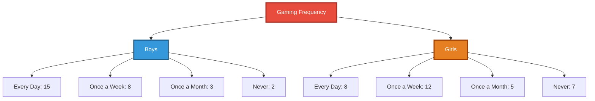

**Discoveries**:
- More boys play every day than girls
- More girls play once a week
- More girls never play than boys

### 🐍 Python Example: Categorical Bivariate Analysis

```python
import pandas as pd
import matplotlib.pyplot as plt
import seaborn as sns

# Create gaming habits data
data = {
    'Gender': ['Boys']*28 + ['Girls']*32,
    'Frequency': ['Every Day']*15 + ['Once a Week']*8 + ['Once a Month']*3 + ['Never']*2 +
                 ['Every Day']*8 + ['Once a Week']*12 + ['Once a Month']*5 + ['Never']*7
}
df_gaming = pd.DataFrame(data)

# Create cross-tabulation (contingency table)
cross_tab = pd.crosstab(df_gaming['Gender'], df_gaming['Frequency'])
print("📊 Cross-Tabulation Table:")
print(cross_tab)
print()

# Calculate percentages
cross_tab_pct = pd.crosstab(df_gaming['Gender'], df_gaming['Frequency'], normalize='index') * 100
print("📊 Percentage Distribution:")
print(cross_tab_pct.round(2))

# Create grouped bar chart
cross_tab.plot(kind='bar', figsize=(12, 6), color=['#E74C3C', '#3498DB', '#2ECC71', '#F39C12'],
               edgecolor='black', linewidth=1.5)
plt.xlabel('Gender', fontsize=13, fontweight='bold')
plt.ylabel('Count', fontsize=13, fontweight='bold')
plt.title('Gaming Frequency by Gender', fontsize=15, fontweight='bold')
plt.legend(title='Frequency', title_fontsize=12, fontsize=11)
plt.xticks(rotation=0)
plt.grid(axis='y', alpha=0.3)
plt.tight_layout()
plt.show()

# Create stacked bar chart
cross_tab_pct.plot(kind='bar', stacked=True, figsize=(12, 6),
                   color=['#E74C3C', '#3498DB', '#2ECC71', '#F39C12'],
                   edgecolor='black', linewidth=1.5)
plt.xlabel('Gender', fontsize=13, fontweight='bold')
plt.ylabel('Percentage (%)', fontsize=13, fontweight='bold')
plt.title('Gaming Frequency Distribution by Gender (%)', fontsize=15, fontweight='bold')
plt.legend(title='Frequency', title_fontsize=12, fontsize=11, bbox_to_anchor=(1.05, 1))
plt.xticks(rotation=0)
plt.tight_layout()
plt.show()

# Create heatmap
plt.figure(figsize=(10, 6))
sns.heatmap(cross_tab, annot=True, fmt='d', cmap='YlOrRd', cbar_kws={'label': 'Count'},
            linewidths=2, linecolor='black')
plt.xlabel('Gaming Frequency', fontsize=13, fontweight='bold')
plt.ylabel('Gender', fontsize=13, fontweight='bold')
plt.title('Gaming Habits Heatmap', fontsize=15, fontweight='bold')
plt.tight_layout()
plt.show()
```

**Output:**
```
📊 Cross-Tabulation Table:
Frequency  Every Day  Never  Once a Month  Once a Week
Gender                                                 
Boys              15      2             3            8
Girls              8      7             5           12

📊 Percentage Distribution:
Frequency  Every Day  Never  Once a Month  Once a Week
Gender                                                 
Boys           53.57   7.14         10.71        28.57
Girls          25.00  21.88         15.62        37.50
```

---

## 🚀 Chapter 6: Derived Metrics (Creating New Information)

Sometimes we can combine information to discover new things!

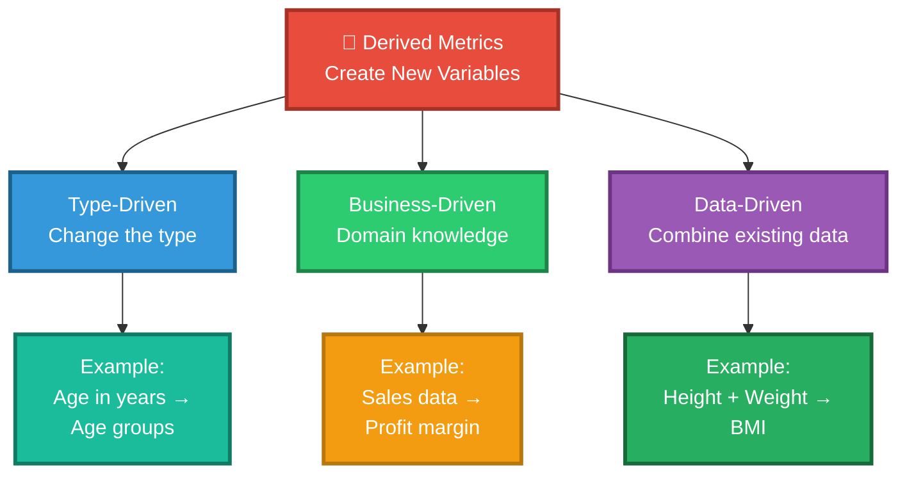

### 🎯 Steven's Typology (Fancy Way to Classify Variables)

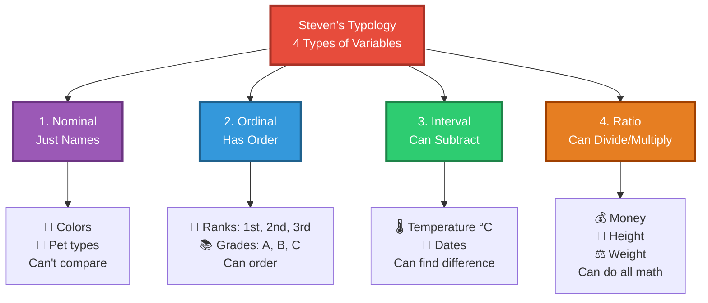

### 🎈 Fun Examples of Derived Metrics

**Type-Driven**: Changing how we look at data
- Age (10, 11, 12, 13...) → Age Groups (Kids, Teens, Adults)
- Exact time (2:34 PM) → Time of day (Morning, Afternoon, Evening)

**Business-Driven**: Using real-world knowledge
- Lemonade sold + Cost → Profit
- Goals scored - Goals allowed → Goal difference

**Data-Driven**: Combining existing data
- Height + Weight → BMI (Body Mass Index)
- Total score ÷ Number of tests → Average score
- Distance ÷ Time → Speed

### 📐 BMI Formula

**Body Mass Index (BMI):**
```
BMI = Weight (kg) / [Height (m)]²

Categories:
- Underweight: BMI < 18.5
- Normal weight: 18.5 ≤ BMI < 25
- Overweight: 25 ≤ BMI < 30
- Obese: BMI ≥ 30
```

### 🐍 Python Example: Creating Derived Metrics

```python
import pandas as pd
import numpy as np
import matplotlib.pyplot as plt

# Create sample data
data = {
    'Name': ['Alice', 'Bob', 'Charlie', 'Diana', 'Eve', 'Frank', 'Grace', 'Henry'],
    'Age': [10, 12, 15, 13, 11, 14, 16, 9],
    'Height_cm': [140, 155, 170, 160, 145, 165, 175, 135],
    'Weight_kg': [35, 45, 60, 50, 38, 55, 65, 30],
    'Test1': [85, 78, 92, 88, 75, 90, 95, 70],
    'Test2': [88, 82, 90, 85, 78, 88, 92, 75],
    'Test3': [90, 80, 95, 90, 80, 92, 98, 72]
}
df = pd.DataFrame(data)

# 1. Type-Driven: Create Age Groups
df['Age_Group'] = pd.cut(df['Age'], bins=[0, 10, 13, 18], 
                         labels=['Kids (≤10)', 'Tweens (11-13)', 'Teens (14+)'])

# 2. Data-Driven: Calculate BMI
df['Height_m'] = df['Height_cm'] / 100  # Convert cm to meters
df['BMI'] = df['Weight_kg'] / (df['Height_m'] ** 2)
df['BMI_Category'] = pd.cut(df['BMI'], 
                             bins=[0, 18.5, 25, 30, 100],
                             labels=['Underweight', 'Normal', 'Overweight', 'Obese'])

# 3. Data-Driven: Calculate Average Test Score
df['Average_Score'] = (df['Test1'] + df['Test2'] + df['Test3']) / 3

# 4. Business-Driven: Performance Category
df['Performance'] = pd.cut(df['Average_Score'],
                            bins=[0, 70, 80, 90, 100],
                            labels=['Needs Improvement', 'Good', 'Very Good', 'Excellent'])

print("📊 Original Data with Derived Metrics:")
print(df[['Name', 'Age', 'Age_Group', 'BMI', 'BMI_Category', 'Average_Score', 'Performance']])

# Visualize BMI distribution
plt.figure(figsize=(14, 6))

# Plot 1: BMI by Person
plt.subplot(1, 2, 1)
colors = ['#E74C3C' if x < 18.5 else '#2ECC71' if x < 25 else '#E67E22' 
          for x in df['BMI']]
bars = plt.bar(df['Name'], df['BMI'], color=colors, edgecolor='black', linewidth=1.5)
plt.axhline(y=18.5, color='red', linestyle='--', label='Underweight threshold')
plt.axhline(y=25, color='orange', linestyle='--', label='Overweight threshold')
plt.xlabel('Name', fontsize=12, fontweight='bold')
plt.ylabel('BMI', fontsize=12, fontweight='bold')
plt.title('BMI by Person', fontsize=14, fontweight='bold')
plt.xticks(rotation=45)
plt.legend()
plt.grid(axis='y', alpha=0.3)

# Plot 2: Average Score by Age Group
plt.subplot(1, 2, 2)
age_group_avg = df.groupby('Age_Group')['Average_Score'].mean()
bars = plt.bar(age_group_avg.index, age_group_avg.values, 
               color=['#9B59B6', '#3498DB', '#2ECC71'], 
               edgecolor='black', linewidth=1.5)
plt.xlabel('Age Group', fontsize=12, fontweight='bold')
plt.ylabel('Average Test Score', fontsize=12, fontweight='bold')
plt.title('Performance by Age Group', fontsize=14, fontweight='bold')
plt.ylim(0, 100)
plt.grid(axis='y', alpha=0.3)

# Add value labels
for bar in bars:
    height = bar.get_height()
    plt.text(bar.get_x() + bar.get_width()/2., height + 1,
             f'{height:.1f}', ha='center', fontweight='bold')

plt.tight_layout()
plt.show()

# Summary statistics
print("\n📈 Summary by Age Group:")
print(df.groupby('Age_Group')[['BMI', 'Average_Score']].mean().round(2))

print("\n📊 Performance Distribution:")
print(df['Performance'].value_counts())
```

**Output:**
```
📊 Original Data with Derived Metrics:
      Name  Age     Age_Group        BMI BMI_Category  Average_Score      Performance
0    Alice   10  Kids (≤10)      17.86   Underweight          87.67         Very Good
1      Bob   12  Tweens (11-13)  18.73        Normal          80.00              Good
2  Charlie   15  Teens (14+)     20.76        Normal          92.33         Excellent
3    Diana   13  Tweens (11-13)  19.53        Normal          87.67         Very Good
4      Eve   11  Tweens (11-13)  18.08   Underweight          77.67              Good
5    Frank   14  Teens (14+)     20.20        Normal          90.00         Excellent
6    Grace   16  Teens (14+)     21.22        Normal          95.00         Excellent
7    Henry    9  Kids (≤10)      16.46   Underweight          72.33              Good

📈 Summary by Age Group:
                    BMI  Average_Score
Age_Group                             
Kids (≤10)        17.16          80.00
Tweens (11-13)    18.78          81.78
Teens (14+)       20.73          92.44

📊 Performance Distribution:
Performance
Excellent              3
Very Good              2
Good                   3
Needs Improvement      0
```

---

## 🎯 The Complete EDA Process

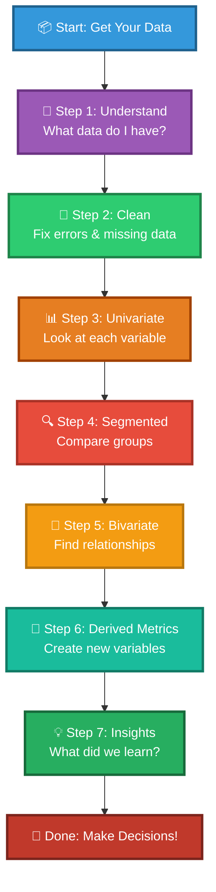

---

## 🎓 Quick Reference Guide

### 📋 EDA Checklist

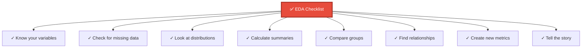

### 🎯 When to Use What

| What You Want to Know | What to Use | Example |
|----------------------|-------------|---------|
| Most common category | Mode | Most popular ice cream flavor |
| Average number | Mean | Average test score |
| Middle value | Median | Middle height in class |
| Spread of data | Range, Std Dev | How different are the scores? |
| Compare groups | Segmented Analysis | Boys vs Girls scores |
| Relationship | Correlation | Study time vs grades |

---

## 🌟 Key Takeaways

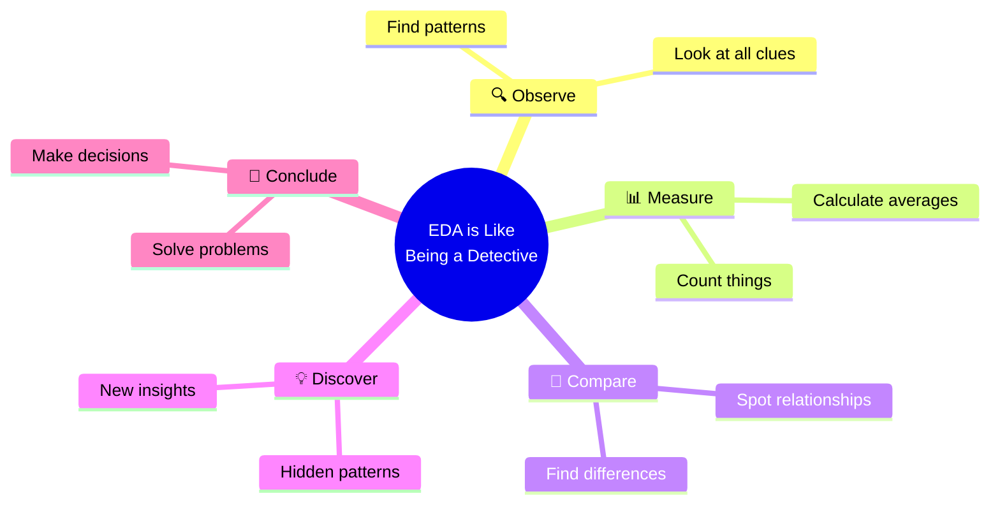

### 🎊 Remember

1. **EDA is exploring** - Like exploring a new playground!
2. **Look at one thing first** - Before looking at many things together
3. **Compare groups** - Find what makes them different
4. **Find relationships** - See how things connect
5. **Create new insights** - Combine information in clever ways
6. **80% of data work is EDA** - It's the most important part!

---

## 🎮 Practice Exercises with Python

### 📝 Exercise 1: Cricket Player Analysis

**Problem:** Analyze a cricket player's performance across different matches.

```python
import pandas as pd
import matplotlib.pyplot as plt
import numpy as np

# Player's runs in 25 matches
runs = [45, 23, 67, 89, 12, 56, 78, 34, 90, 45, 67, 23, 89, 56, 78, 
        34, 45, 67, 89, 23, 56, 78, 45, 67, 90]

# Tasks:
# 1. Calculate mean, median, mode
# 2. Find the range
# 3. Create bins: 0-20, 21-40, 41-60, 61-80, 81-100
# 4. Plot a histogram showing frequency in each bin
# 5. Answer: In which bucket did the player score most often?

# Your code here:
```

<details>
<summary>💡 Click to see solution</summary>

```python
# Solution
mean_runs = np.mean(runs)
median_runs = np.median(runs)
from scipy import stats
mode_runs = stats.mode(runs, keepdims=True)[0][0]
range_runs = np.max(runs) - np.min(runs)

print(f"Mean: {mean_runs:.2f}")
print(f"Median: {median_runs}")
print(f"Mode: {mode_runs}")
print(f"Range: {range_runs}")

# Create bins
bins = [0, 20, 40, 60, 80, 100]
labels = ['0-20', '21-40', '41-60', '61-80', '81-100']
runs_binned = pd.cut(runs, bins=bins, labels=labels)
frequency = runs_binned.value_counts().sort_index()

print(f"\nMost frequent bucket: {frequency.idxmax()} (appeared {frequency.max()} times)")

# Plot
plt.figure(figsize=(10, 6))
bars = plt.bar(frequency.index, frequency.values, color='#2ECC71', edgecolor='black')
plt.xlabel('Runs Bucket')
plt.ylabel('Frequency')
plt.title('Cricket Player: Runs Distribution')
for bar in bars:
    height = bar.get_height()
    plt.text(bar.get_x() + bar.get_width()/2., height, f'{int(height)}',
             ha='center', va='bottom', fontweight='bold')
plt.show()
```
</details>

---

### 📝 Exercise 2: Student Performance by Subject

**Problem:** Compare student performance across different subjects.

```python
# Student scores in different subjects
data = {
    'Student': ['A', 'B', 'C', 'D', 'E', 'F', 'G', 'H', 'I', 'J'],
    'Math': [85, 78, 92, 88, 75, 90, 95, 70, 82, 88],
    'Science': [88, 82, 90, 85, 78, 88, 92, 75, 85, 90],
    'English': [90, 80, 95, 90, 80, 92, 98, 72, 88, 92]
}

# Tasks:
# 1. Calculate average score for each subject
# 2. Find which subject has highest average
# 3. Create a grouped bar chart
# 4. Calculate correlation between Math and Science
# 5. Create a scatter plot showing Math vs Science scores
```

<details>
<summary>💡 Click to see solution</summary>

```python
df = pd.DataFrame(data)

# Average scores
avg_scores = df[['Math', 'Science', 'English']].mean()
print("Average Scores:")
print(avg_scores)
print(f"\nHighest average: {avg_scores.idxmax()} ({avg_scores.max():.2f})")

# Grouped bar chart
df.set_index('Student')[['Math', 'Science', 'English']].plot(kind='bar', figsize=(12, 6))
plt.ylabel('Score')
plt.title('Student Performance by Subject')
plt.legend(title='Subject')
plt.xticks(rotation=45)
plt.grid(axis='y', alpha=0.3)
plt.tight_layout()
plt.show()

# Correlation
correlation = np.corrcoef(df['Math'], df['Science'])[0, 1]
print(f"\nCorrelation between Math and Science: {correlation:.3f}")

# Scatter plot
plt.figure(figsize=(8, 6))
plt.scatter(df['Math'], df['Science'], s=100, color='#3498DB', edgecolor='black')
plt.xlabel('Math Score')
plt.ylabel('Science Score')
plt.title(f'Math vs Science Scores (r = {correlation:.3f})')
plt.grid(alpha=0.3)
plt.show()
```
</details>

---

### 📝 Exercise 3: Sales Analysis by Region

**Problem:** Analyze sales data across different regions and product categories.

```python
# Sales data
sales_data = {
    'Region': ['North']*6 + ['South']*6 + ['East']*6 + ['West']*6,
    'Product': ['A', 'B', 'C']*8,
    'Sales': [120, 150, 180, 130, 160, 190, 140, 170, 200, 125, 155, 185,
              135, 165, 195, 145, 175, 205, 128, 158, 188, 138, 168, 198]
}

# Tasks:
# 1. Create a cross-tabulation of Region vs Product
# 2. Find which region has highest total sales
# 3. Find which product sells best overall
# 4. Create a heatmap showing sales by region and product
# 5. Calculate average sales by region
```

<details>
<summary>💡 Click to see solution</summary>

```python
import seaborn as sns

df_sales = pd.DataFrame(sales_data)

# Cross-tabulation
cross_tab = pd.crosstab(df_sales['Region'], df_sales['Product'], 
                        values=df_sales['Sales'], aggfunc='sum')
print("Sales by Region and Product:")
print(cross_tab)

# Total sales by region
region_total = df_sales.groupby('Region')['Sales'].sum()
print(f"\nHighest sales region: {region_total.idxmax()} (${region_total.max()})")

# Best selling product
product_total = df_sales.groupby('Product')['Sales'].sum()
print(f"Best selling product: {product_total.idxmax()} (${product_total.max()})")

# Heatmap
plt.figure(figsize=(10, 6))
sns.heatmap(cross_tab, annot=True, fmt='d', cmap='YlGnBu', cbar_kws={'label': 'Sales ($)'})
plt.title('Sales Heatmap: Region vs Product')
plt.tight_layout()
plt.show()

# Average by region
avg_by_region = df_sales.groupby('Region')['Sales'].mean()
print("\nAverage Sales by Region:")
print(avg_by_region)
```
</details>

---

### 📝 Exercise 4: Create Your Own Analysis!

**Challenge:** Collect your own data and perform complete EDA!

**Ideas:**
1. 📱 Screen time tracking for a week
2. 🏃 Daily steps count
3. 🌡️ Temperature readings
4. 🎮 Game scores over time
5. 📚 Time spent on different activities

**Steps to follow:**
1. Collect at least 20 data points
2. Perform univariate analysis (mean, median, mode, range)
3. Create appropriate visualizations
4. If you have two variables, check for correlation
5. Create at least one derived metric
6. Write a summary of your findings

**Template Code:**
```python
import pandas as pd
import matplotlib.pyplot as plt
import numpy as np

# Your data here
my_data = {
    'Variable1': [],  # Add your data
    'Variable2': []   # Add your data if applicable
}

df = pd.DataFrame(my_data)

# Step 1: Basic statistics
print("Summary Statistics:")
print(df.describe())

# Step 2: Visualizations
# Add your plots here

# Step 3: Analysis
# Add your analysis here

# Step 4: Insights
print("\n📊 My Findings:")
# Write what you discovered!
```

---

### 🎯 Quick Practice Questions

Answer these using Python:

1. **Q:** Given scores `[65, 70, 75, 80, 85, 90, 95]`, what is the mean and standard deviation?

2. **Q:** Create a bar chart showing frequency of grades: A(5), B(8), C(6), D(3), F(1)

3. **Q:** Calculate correlation between study hours `[2, 4, 6, 8, 10]` and scores `[60, 70, 80, 90, 95]`

4. **Q:** Create age groups from ages `[8, 12, 15, 9, 13, 16, 10, 14, 11, 17]`: Kids(≤10), Tweens(11-13), Teens(14+)

5. **Q:** Calculate BMI for: Height=165cm, Weight=60kg. Categorize the result.

---

## 🎨 Visual Summary

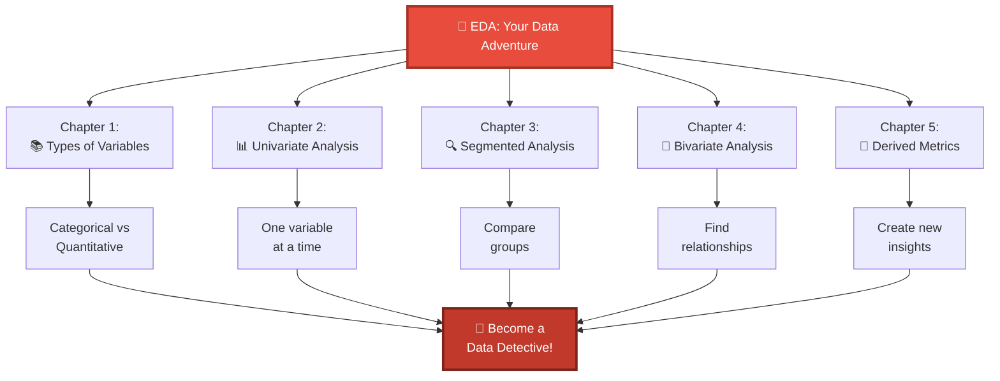

---

## 🌈 Conclusion

**Exploratory Data Analysis** is like being a detective with numbers! You:
- 🔍 Look carefully at your data
- 📊 Make charts and graphs
- 🧮 Calculate important numbers
- 🤔 Compare different groups
- 💡 Discover hidden patterns
- 🎯 Make smart decisions

The more you explore, the more you discover! Just like exploring a new video game or a new park, data exploration is an adventure where you find cool things the more you look!

**Remember**: Every great data scientist started by being curious and asking questions. Keep exploring! 🚀

---

*Made with ❤️ for young learners and curious minds!*

---

## 📚 Glossary (Word Bank)

- **Variable**: A piece of information (like age, color, or score)
- **Categorical**: Information in categories/groups (like colors or types)
- **Quantitative**: Number information you can measure
- **Mean**: Average (add all numbers and divide by count)
- **Median**: The middle number when sorted
- **Mode**: The most common value
- **Correlation**: How two things relate to each other
- **Distribution**: How data is spread out
- **Metric**: A way to measure something

---

## 💻 Hands-On Practice

**Ready to practice with real data?**

Check out the **[Jupyter Notebook with EDA Examples]({{ site.baseurl }}/notebooks/statistics/chapter1_eda_examples.ipynb)** using the Iris dataset!

**What's included:**
- ✅ Complete working code
- ✅ Real dataset (Iris flowers)
- ✅ Step-by-step visualizations
- ✅ Summary statistics examples
- ✅ Pattern discovery exercises

**To run the notebook:**
1. Install: `pip install pandas numpy matplotlib seaborn scikit-learn jupyter`
2. Download the notebook from the repository
3. Run: `jupyter notebook chapter1_eda_examples.ipynb`

📖 See the [notebooks README]({{ site.baseurl }}/notebooks/statistics/README.md) for full instructions!
