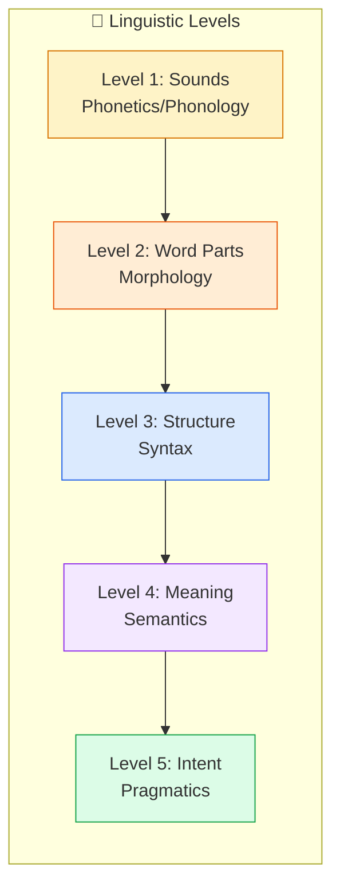

# Natural Language Processing - A Friendly Introduction

## Why This Guide Exists

Every day, you use Natural Language Processing dozens of times without realizing it. When your phone autocorrects "teh" to "the," when Alexa understands you asking for the weather, when Gmail filters spam, when Google translates a website—you are using NLP.

But what exactly is it? And how do computers—machines that only understand ones and zeros—manage to understand human language?

This guide explains NLP in plain English, using simple stories and real examples. No PhD required.

---

## Segment 1: Course Overview

**What you will learn:**
- What Natural Language Processing actually is (without the jargon)
- Where NLP is used in the real world
- The different levels of language analysis
- How the NLP pipeline works from start to finish
- The different approaches to building NLP systems

**By the end:** You will understand the complete landscape of NLP and be ready to dive deeper into specific techniques.

---

## Segment 2: Session Overview

### The Big Picture

Imagine you are teaching a friend who has never heard human language before. You would need to explain:
1. What words mean (vocabulary)
2. How words fit together (grammar)
3. What sentences actually mean (meaning)
4. Why someone is saying something (intent)

NLP does exactly this—but for computers. It breaks language down into layers and teaches machines to understand each one.

### Key Questions We Will Answer

- How does Siri understand your voice commands?
- How does Google know what you mean even if you type the wrong words?
- How do spam filters catch junk mail?
- How can a computer read thousands of reviews and tell you if customers are happy?

---

## Segment 3: What is Natural Language Processing?

### The Simple Definition

**Natural Language Processing (NLP)** is the technology that helps computers understand, interpret, and respond to human language.

That is it. No magic. Just teaching computers to work with the messy, irregular, creative language that humans use every day.

### The "Natural" Part

Computers already have languages—programming languages like Python and JavaScript. These are:
- Strict (one typo and everything breaks)
- Precise (every command means exactly one thing)
- Structured (follow rigid rules)

Human language is the opposite:
- Flexible ("I am happy," "I'm happy," and "Feeling great!" all mean the same thing)
- Ambiguous ("The chicken is ready to eat"—is the chicken eating or being eaten?)
- Messy (slang, typos, sarcasm, regional dialects)

NLP bridges this gap.

### A Real-World Analogy

Think of NLP as a universal translator between two worlds:

| Human World | NLP Bridge | Computer World |
|-------------|------------|----------------|
| "What's the weather like?" | Processing | `intent: weather_query, location: current` |
| An angry customer review | Analysis | `sentiment: negative, topics: [service, wait_time]` |
| "Book a table for 2 at 7pm" | Understanding | `action: reservation, party_size: 2, time: 19:00` |

---

## Segment 4: NLP Applications Across Industries

### Healthcare
**Medical Transcription:** Doctors speak, computers write. NLP converts speech to text and organizes it into structured medical records.

**Clinical Decision Support:** Systems read patient records and suggest diagnoses: "Patient mentions chest pain + shortness of breath → Consider cardiac evaluation."

### Finance
**Sentiment Analysis:** Hedge funds scan Twitter, news articles, and earnings calls to gauge market mood before making trades.

**Fraud Detection:** Unusual language patterns in emails or messages can flag potential scams.

### Customer Service
**Chatbots:** Handle routine questions instantly. "What are your hours?" → Immediate answer, no human needed.

**Ticket Routing:** An email saying "I can't log in" automatically goes to IT support; "I want a refund" goes to billing.

### E-Commerce
**Product Search:** You type "comfy shoes for standing all day" and get relevant results—even if no product description uses exactly those words.

**Review Analysis:** Automatically spot fake reviews by analyzing writing patterns.

### Legal
**Contract Analysis:** Read thousands of pages in minutes, flag risky clauses, extract key dates and obligations.

**Legal Research:** Find relevant case law by understanding the concepts, not just matching keywords.

### Education
**Automated Grading:** Essay scoring systems evaluate writing quality, grammar, and argument structure.

**Language Learning:** Apps like Duolingo use NLP to check pronunciation and suggest corrections.

### Everyday Life
- **Smart assistants** (Siri, Alexa, Google Assistant)
- **Spell check and grammar tools** (Grammarly)
- **Email spam filters**
- **Autocomplete suggestions**
- **Voice-to-text messaging**
- **Translation apps**

---

## Segment 5: Linguistic Levels in NLP

Language has layers, like an onion. NLP works through these layers from simple to complex.

### Level 1: Phonetics and Phonology (Sounds)
**What it is:** How words sound and how sounds form patterns.

**NLP application:** Speech recognition, text-to-speech.

**Example:** Teaching a system that "knight" and "night" sound identical.

### Level 2: Morphology (Word Parts)
**What it is:** How words are built from smaller pieces.

**NLP application:** Stemming, lemmatization.

**Example:** Understanding that "running," "runs," and "ran" all relate to "run."

### Level 3: Syntax (Sentence Structure)
**What it is:** How words arrange to form grammatically correct sentences.

**NLP application:** Parsing, grammar checking.

**Example:** Knowing "The cat sat on the mat" is grammatical, but "Cat mat the on sat the" is not.

### Level 4: Semantics (Meaning)
**What it is:** What sentences actually mean.

**NLP application:** Named entity recognition, word sense disambiguation.

**Example:** Knowing "bank" means a financial institution in "I went to the bank" but the edge of a river in "We sat on the river bank."

### Level 5: Pragmatics (Context and Intent)
**What it is:** What someone actually intends to communicate, considering context.

**NLP application:** Dialogue systems, sentiment analysis.

**Example:** Understanding that "Oh, great" means disappointment when someone spills coffee on their laptop.



---

## Segment 6: Stages of the NLP Pipeline

Most NLP systems follow a standard workflow. Think of it as an assembly line that transforms raw text into useful information.

### Stage 1: Data Collection
**What happens:** Gathering text from various sources.

**Examples:**
- Scraping websites
- Collecting customer support emails
- Recording speech
- Importing social media posts

### Stage 2: Text Preprocessing (Cleaning)
**What happens:** Making text uniform and usable.

**Steps include:**
- Converting to lowercase
- Removing extra spaces and special characters
- Handling encoding issues
- Fixing typos (optional)

**Example:**
```
Raw: "   HELLO!!!   How R U???   "
Cleaned: "hello how r u"
```

### Stage 3: Tokenization
**What happens:** Breaking text into smaller pieces (usually words or sentences).

**Example:**
```
"The quick brown fox."
↓
["The", "quick", "brown", "fox", "."]
```

### Stage 4: Normalization
**What happens:** Reducing words to their base forms.

**Techniques:**
- **Stemming:** Chop off endings (running → run)
- **Lemmatization:** Use vocabulary analysis (better, best → good)
- **Stopword removal:** Remove common words (the, and, is)

### Stage 5: Part-of-Speech Tagging
**What happens:** Labeling each word with its grammatical role.

**Example:**
```
The/DT quick/JJ brown/JJ fox/NN jumps/VBZ
```
(DT = determiner, JJ = adjective, NN = noun, VBZ = verb)

### Stage 6: Parsing (Understanding Structure)
**What happens:** Analyzing how words relate to each other.

**Types:**
- **Dependency parsing:** Who does what to whom
- **Constituency parsing:** Phrase structure (noun phrases, verb phrases)

### Stage 7: Feature Extraction
**What happens:** Converting text into numbers that algorithms can process.

**Methods:**
- Bag of Words
- TF-IDF
- Word embeddings

### Stage 8: Modeling/Analysis
**What happens:** Applying machine learning or rules to extract insights.

**Tasks:**
- Classification (spam vs. not spam)
- Named entity recognition (find names, dates, places)
- Sentiment analysis (positive vs. negative)

### Stage 9: Output/Deployment
**What happens:** Presenting results to users or other systems.

**Examples:**
- Displaying sentiment scores on a dashboard
- Triggering a chatbot response
- Storing structured data in a database


---

## Segment 7: Approaches of NLP Systems

There are three main ways to build NLP systems. Think of them as different teaching styles for the same subject.

### Approach 1: Rule-Based Systems
**The method:** Write explicit rules that the computer follows.

**How it works:**
- Linguists write grammar rules
- Domain experts create dictionaries
- Pattern matching finds specific structures

**Example rule:**
```
IF word ends with "ing" AND previous word is a form of "be"
THEN it is likely a present continuous verb
```

**Pros:**
- Transparent (you can see exactly why it made a decision)
- No training data required
- Works well for structured domains

**Cons:**
- Brittle (doesn't handle unexpected inputs)
- Expensive to maintain
- Cannot learn or improve automatically

**Best for:** Grammar checkers, simple chatbots, controlled vocabularies.

### Approach 2: Statistical/Machine Learning
**The method:** Learn patterns from examples.

**How it works:**
- Feed the system thousands of labeled examples
- It discovers statistical patterns
- Uses those patterns to make predictions on new data

**Example:**
Given 10,000 emails labeled "spam" or "not spam," the system learns:
- "FREE!!!" often appears in spam
- "Meeting at 3pm" often appears in non-spam

**Pros:**
- Adapts to new data
- Handles messy real-world language
- Scales to large datasets

**Cons:**
- Needs lots of training data
- The "why" can be opaque
- Can inherit biases from training data

**Best for:** Spam detection, sentiment analysis, classification tasks.

### Approach 3: Deep Learning/Neural Networks
**The method:** Use artificial neural networks with many layers.

**How it works:**
- Networks learn complex representations automatically
- Can capture context and word relationships
- Modern transformers (like BERT, GPT) understand context deeply

**Example:**
```
"The bank" → System considers surrounding words
"The bank was closed on Sunday" → Financial institution
"The river bank was muddy" → Edge of a river
```

**Pros:**
- State-of-the-art accuracy
- Understands context and nuance
- Learns features automatically

**Cons:**
- Requires massive computing power
- Needs huge amounts of data
- "Black box"—hard to explain decisions

**Best for:** Translation, complex question answering, modern assistants.

### Comparison Summary

| Approach | Data Needed | Accuracy | Explainability | Maintenance |
|----------|-------------|----------|----------------|-------------|
| Rule-based | None | Medium | High | Hard |
| Machine Learning | Lots | High | Low | Medium |
| Deep Learning | Massive | Very High | Very Low | Medium |

---

## Segment 8: Session Summary

### What We Covered

1. **What NLP is:** Teaching computers to work with human language.

2. **Where it's used:** Healthcare, finance, customer service, e-commerce, legal, education, and everyday apps.

3. **Linguistic levels:** Sounds → Word parts → Structure → Meaning → Intent.

4. **The pipeline:** Collection → Preprocessing → Tokenization → Normalization → Tagging → Parsing → Features → Modeling → Output.

5. **Three approaches:** Rules (explicit), Machine Learning (statistical), Deep Learning (neural).

### Key Takeaways

- **NLP bridges human language and computer understanding.**
- **Language has layers,** and NLP systems work through them systematically.
- **The pipeline is modular—** you can use different techniques at each stage.
- **Choose your approach based on** accuracy needs, data availability, and explainability requirements.

---

## Segment 9: Practice Questions

### Quick Check Questions

**1. What does NLP stand for and what does it do?**
<details>
<summary>Answer</summary>
Natural Language Processing. It helps computers understand, interpret, and respond to human language.
</details>

**2. Name three real-world applications of NLP.**
<details>
<summary>Answer</summary>
Any three from: virtual assistants, spam filters, translation apps, chatbots, sentiment analysis, speech-to-text, grammar checkers, search engines.
</details>

**3. What are the five linguistic levels of language, in order?**
<details>
<summary>Answer</summary>
1. Phonetics/Phonology (sounds)
2. Morphology (word parts)
3. Syntax (structure)
4. Semantics (meaning)
5. Pragmatics (intent)
</details>

**4. What happens during tokenization?**
<details>
<summary>Answer</summary>
Breaking text into smaller pieces, typically words or sentences.
</details>

**5. What are the three main approaches to building NLP systems?**
<details>
<summary>Answer</summary>
1. Rule-based (explicit rules)
2. Statistical/Machine Learning (learning from examples)
3. Deep Learning (neural networks)
</details>

### Thought Questions

**6. Why might a rule-based system struggle with social media text?**
<details>
<summary>Hint</summary>
Think about slang, typos, abbreviations, and new expressions.
</details>

**7. If you were building a medical diagnosis system, which approach would you prioritize and why?**
<details>
<summary>Hint</summary>
Consider accuracy needs vs. explainability requirements.
</details>

**8. Which stage of the NLP pipeline would be most critical for a spell-checker?**
<details>
<summary>Hint</summary>
Where does text get cleaned and standardized?
</details>

---

## What Comes Next?

Now that you understand the landscape of NLP, the next guides will dive deeper into specific stages:

- **Lexical Processing:** How computers break down words (tokenization, stemming, lemmatization)
- **Syntactic Processing:** How computers understand sentence structure (parsing, grammar)

Each guide builds on this foundation, using the same friendly, example-driven approach.

The journey from raw text to computer understanding starts here.
